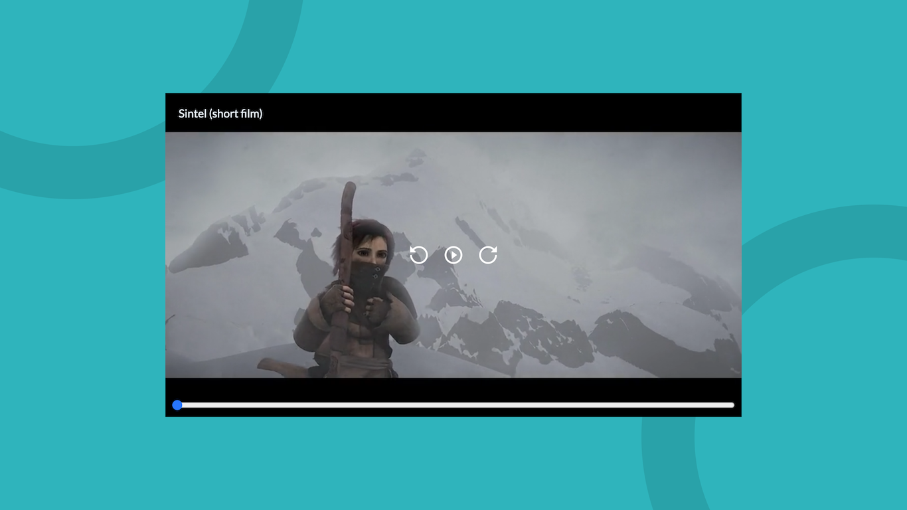
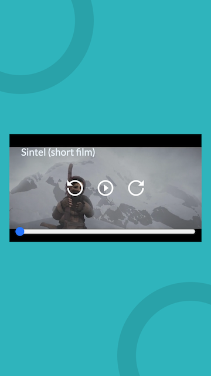

# Video player

This is the project of the [course intro to web development](https://leonidasesteban.com/cursos/desarrollo-web).

## Desktop

## Mobile

### Feautes

- Title, control buttons and bar progress on hover
- Mobile responsive

### Links

- [Website](https://iscasur.github.io/video-player/)
- [Figma](https://www.figma.com/file/JqCSv6LH1BwoXvlBhsa0wp/Video_Player_aVdxzOV?node-id=0%3A1)
- [Video Player](https://leonidasesteban.com/proyectos/video-player)

## Technologies

- HTML
- CSS
- JavaScript

# Licence

This proyect is MIT licensed
